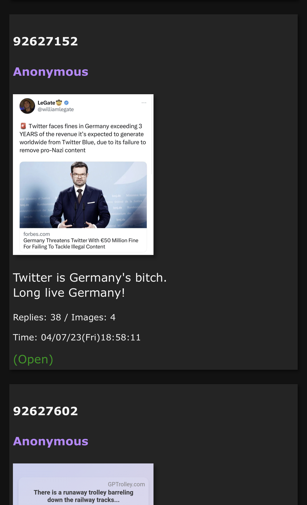
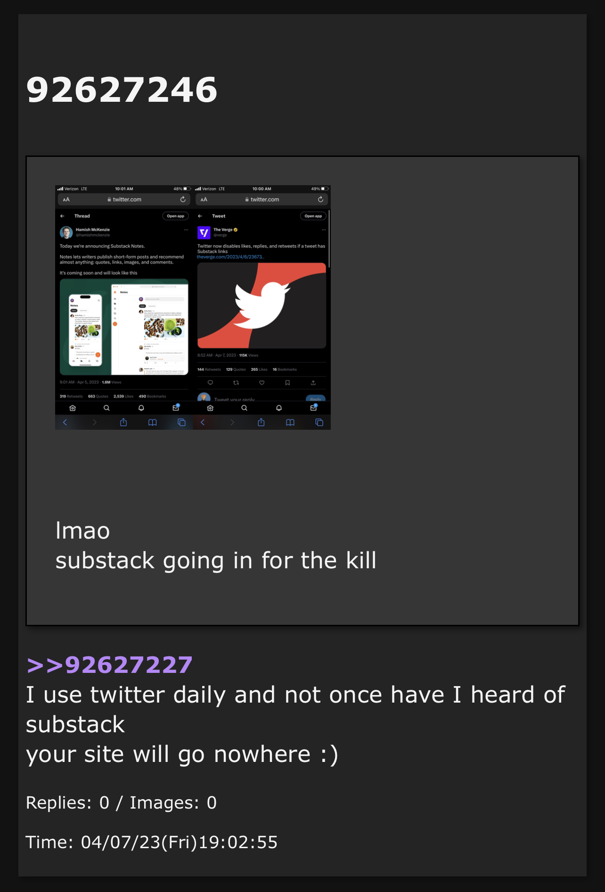

# gochan
A self-hosted 4Chan frontend server that makes browsing 4Chan on mobile devices far easier! It still has many features planned and lots of new stuff on the way.

### Why?
GoChan was made to address a few issues I have as a 4Chan user:
* 4Chan doesn't have an app for iOS and any app developed for iOS is taken down after a certain time once Apple catches on. Yes, I am aware of Sigma, it's a great app but it's not 4Chan-focused - I also hate the Reddit-style approach to thread-layout.
* If used through a mobile web-browser, 4Chan looks pretty bad. It's a site built with Desktop use in mind. There have been some improvements recently but I still find it cumbersome to use on mobile.

GoChan addresses these issues by building in a mobile-first manner:
* A nice user interface, buttons and text which is big enough for mobile and a decent colour scheme (dark/light mode switcher is planned, currently it's just dark).
* Ability to add GoChan to your homescreen with PWA capabilities built-in, this means that it acts just like a regular app would once opened from the homescreen (no browser interface, just the app). To do this see the following (wordy) guide:

[How to add a website to home screen on iOS and Android](https://techwiser.com/how-to-add-a-website-to-home-screen-on-ios-and-android/)

### Interface
Here are some screenshots of the user interface:

The homescreen:

The board view (this is /g/, for example):

A view of a thread, you can see the number of replies and images, when the thread was made, the name and number of the thread etc...

A view from within a thread, clicking a post quote (e.g `>>92834724`) gives a preview of the post (including text and images) that the user was replying to.


The interface is functional and doesn't look too bad for now. It will be improved in the future. I wanted to ensure it wasn't too bloated or ultra-modern as that wouldn't fit with the general 4Chan look.

### Installation and Configuration
Installation is purposefully very easy. We'll start with building and running the Go binary. To do this, ensure you have Go installed and setup on your system and do the following:

NOTE: The default port used by GoChan is 4433, this can be changed by adding a $PORT environment variable prior to running. You may have to ammend the Dockerfile and Compose file to achieve this if you're using Docker to run it.

Clone the repo and enter the gochan directory within the repo:
```bash
git clone https://github.com/alex-ogden/gochan.git
cd gochan/gochan
```

Now build the executable and run it
```bash
go build -o gochan *
./gochan
```

You can optionally redirect logs to /dev/null by appending `&> /dev/null` to the `./gochan` command.

Running the binary executable is (probably) the fastest way to run GoChan. Images that are downloaded (see known issues below) will be stored in `gochan/static/images`.

#### Build Docker Image
To build the docker image, clone the repo and enter the root:
```bash
git clone https://github.com/alex-ogden/gochan.git
cd gochan
```

Now, build the docker image
```bash
CONTAINER_NAME="gochan"
docker build -t "${CONTAINER_NAME}" .
```

#### Run Compose
Once the image has built successfully, you can start up the compose service using the provided `docker-compose.yml` file.

```bash
docker compose up -d
```

Docker Compose will automatically create a volume and mount it to the container to hold the images downloaded by GoChan (see known issues below)

You should now be able to access GoChan at:
```
http://localhost:4433
```
Ammend the address and port to suit your setup and when connecting from another device.

### Troubleshooting
Everything should work correctly, however if something does go wrong, see the logs raised by the service using either `docker logs ${CONTAINER_NAME}` or by running the executable and ensuring logs are fed to stdout/stderr or to a file.

### Known Issues

##### Thread/Board Images:
Due to limitations of the 4Chan read-only API, it's not possible to reference images via URL (using `i.4cdn.org`) - this is a CORS issue. If you want to try using a CORS proxy feel free however I've not had much luck so far. Due to this, GoChan needs to pre-download the images to the filesystem before loading a thread/board. This can cause slowdowns on slow connections or in threads with many high-res images however the download process is handled via goroutines so it's about as fast as it can be. It will clear all downloaded images before loading a new thread or board so you shouldn't have a problem with disk usage.
